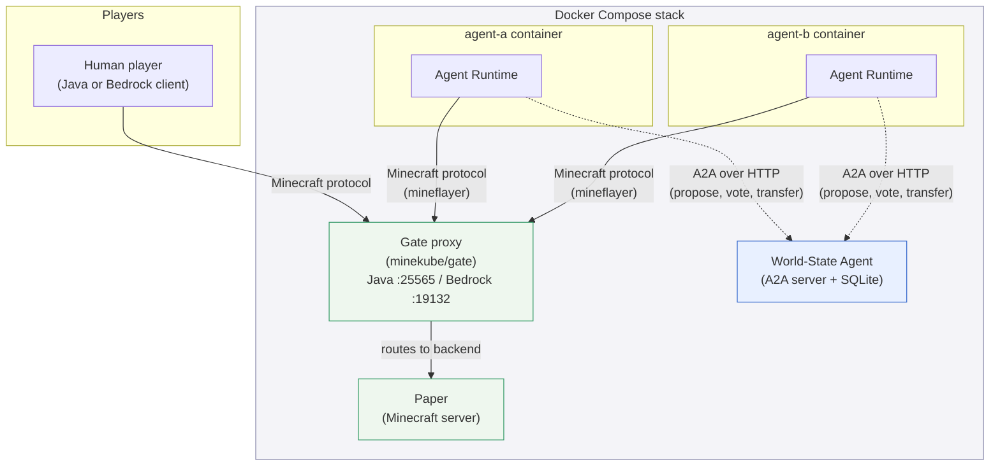
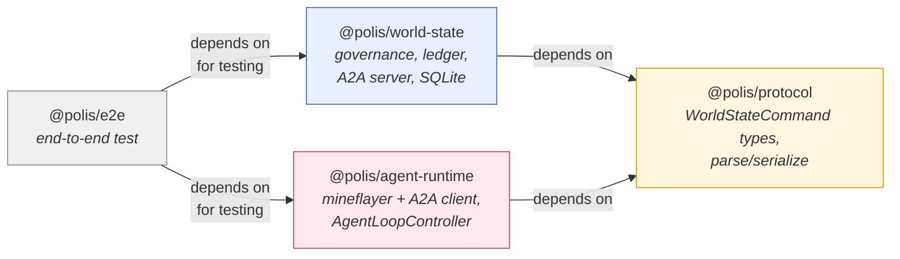
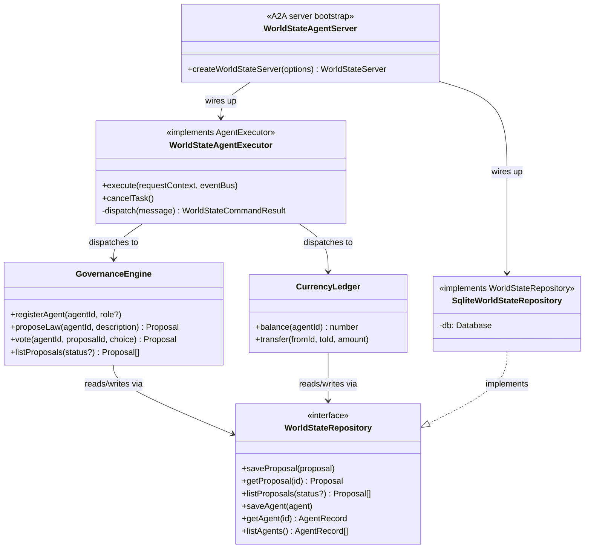
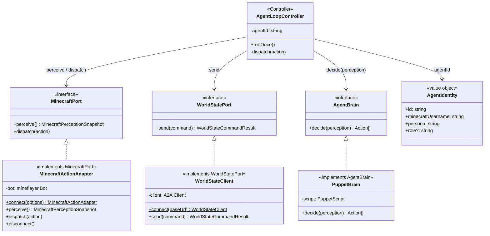
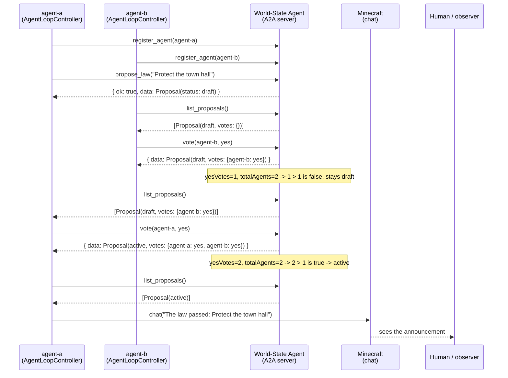
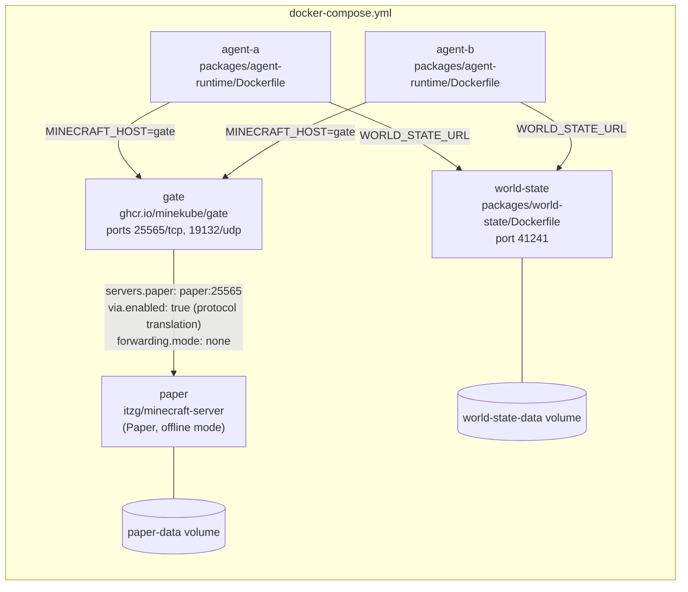

<p align="center">
  
</p>

Polis lets human players and small populations of scripted or LLM-driven
agents share a single Minecraft world behind a proxy, with governance (laws,
votes) and a currency emerging from agent negotiation rather than being
hardcoded by the server. Agent-to-governance communication runs over the
[A2A (Agent2Agent) protocol](https://a2a-protocol.org/), so the shared
civilization state is itself just another addressable agent, not a bespoke
REST API.

This repository is the **foundation**: the shared World-State Agent, an
Agent Runtime that can join a real Minecraft server and act on scripted
decisions, and the Docker/Gate wiring that puts humans and agents in the
same world. An LLM-driven brain is a deliberate follow-up — see
[Current Scope](#current-scope) below.

## Contents

- [Use Cases](#use-cases)
- [High-Level Architecture](#high-level-architecture)
- [Repository Structure](#repository-structure)
- [World-State Agent](#world-state-agent)
- [Agent Runtime](#agent-runtime)
- [Local LLM Brain (Ollama)](#local-llm-brain-ollama)
- [Governance: How a Proposal Becomes Law](#governance-how-a-proposal-becomes-law)
- [Docker Compose Topology](#docker-compose-topology)
- [Current Scope](#current-scope)
- [Development](#development)
- [Running the Stack](#running-the-stack)
- [License](#license)
- [Acknowledgments](#acknowledgments)

## Use Cases

**Multi-agent systems research.** A controllable, inspectable sandbox for
studying how LLM agents negotiate, form coalitions, and govern themselves
over long horizons — without needing to instrument a black-box game engine.
Every governance action is a typed A2A message and a SQLite row, so a
session's full decision history is queryable after the fact, not just
observable as game footage.

**Evaluating LLM social and negotiation behavior.** Swap `PuppetBrain` for
an LLM-backed `AgentBrain` (the interface is designed for exactly this) and
compare how different models propose, vote, and cooperate under the same
fixed quorum rule — a controlled variable other "agents in Minecraft"
demos don't hold constant.

**Community servers with persistent AI townsfolk.** Run a small population
of agents alongside human players on a normal Paper server. Agents can
hold roles, accumulate currency, and pass rules the way a self-governing
community would, giving a server persistent NPCs that aren't scripted quest
-givers.

**Teaching multi-agent architecture and OOAD.** The codebase is small
enough to read end to end in an afternoon and deliberately annotated with
GRASP patterns (Information Expert, Controller, Protected Variations, Pure
Fabrication) at real call sites — useful as a worked example for a systems
design or software architecture course.

**A benchmark environment for agent-to-agent protocols.** Because
governance runs over the real A2A protocol rather than an ad hoc API, Polis
doubles as a concrete, runnable example of A2A agent-to-agent messaging
outside of the protocol's own reference samples.

**Streamed or observed "AI civilization" sessions.** Because meaningful
governance outcomes are always announced in Minecraft chat (not just logged
to a database), a human audience — playing, spectating, or watching a
stream — can follow the emerging society in real time without needing
protocol-level tooling.

## High-Level Architecture

Two communication channels are deliberately kept separate. In-game Minecraft
chat is what humans read and can address agents through. The A2A protocol
carries structured governance traffic — proposals, votes, currency transfers
— between agents and the World-State Agent. Because that traffic isn't
visible in-game, each agent announces meaningful outcomes (a law passing) in
chat, so a human watching the world can still see the civilization emerge.



**In-game chat** (solid arrows above) is the human-visible channel: chat,
movement, mining. **A2A** (dashed arrows) is the structured,
human-invisible-by-default channel: an agent registering itself, proposing a
law, voting, or transferring currency. Gate is never involved in A2A
traffic — it only proxies raw Minecraft connections.

## Repository Structure

An npm-workspaces TypeScript monorepo. `protocol` has no dependencies;
`world-state` and `agent-runtime` both depend on it as their shared wire
format, but not on each other.



| Package | Responsibility |
|---|---|
| `packages/protocol` | Shared `WorldStateCommand` / `WorldStateCommandResult` types and the parse/serialize functions both other packages use as their wire format. |
| `packages/world-state` | Owns the civilization's shared state — the agent registry, law proposals and votes, and the currency ledger — exposed as a real A2A-addressable agent, backed by SQLite. |
| `packages/agent-runtime` | Connects one agent to Minecraft (via `mineflayer`) and to the World-State Agent (via an A2A client), driven by a pluggable decision-making interface. |
| `packages/e2e` | End-to-end test proving the full propose → vote → active law → chat announcement flow over real infrastructure. |
| `gate/`, `docker-compose.yml` | Gate proxy config and the compose stack wiring Paper, Gate, World-State, and two agent containers together. |

## World-State Agent

The World-State Agent is a small Express server speaking the real A2A
protocol (`@a2a-js/sdk`) — it publishes an Agent Card describing its
skills and answers `sendMessage` calls by dispatching to plain, framework-free
domain logic underneath. Design follows GRASP: each class has one
information-holding or coordinating responsibility.



| Class | GRASP pattern | Why |
|---|---|---|
| `WorldStateAgentExecutor` | Pure Fabrication | Doesn't map to a real-world civilization concept — exists purely to bridge the A2A protocol's event model to the domain logic below it. |
| `GovernanceEngine` / `CurrencyLedger` | Information Expert | Each owns the data (proposals/votes, balances) needed to validate its own operations. |
| `WorldStateRepository` (interface) | Protected Variations | `GovernanceEngine`/`CurrencyLedger` never see SQLite directly — swapping persistence later is a one-file change. |

**Skills exposed over A2A:** `register_agent`, `propose_law`, `vote`,
`transfer_currency`, `list_proposals`. Every skill call is a JSON-encoded
[`WorldStateCommand`](packages/protocol/src/commands.ts) sent as an A2A text
message part; the executor parses it, dispatches to the domain logic, and
returns a `{ ok, data | error }` result as a text artifact.

**Governance rule (fixed, not configurable):** a proposal becomes an active
law once yes-votes exceed half of all currently registered agents; it's
rejected once no-votes reach or exceed half. Nothing about the law's
*content* is hardcoded — only this quorum mechanism is.

## Agent Runtime

One container per agent. Two small "port" interfaces —
[`MinecraftPort`](packages/agent-runtime/src/types.ts) and
[`WorldStatePort`](packages/agent-runtime/src/types.ts) — decouple the
decision-making brain from both mineflayer and the A2A SDK, so a future LLM
brain can be swapped in without touching the Minecraft or governance-wiring
code at all.



**Per tick, `AgentLoopController.runOnce()`:**

1. Pulls a Minecraft perception snapshot (recent chat, position, health) from
   the `MinecraftPort`.
2. Fetches all proposals from the `WorldStatePort` (`list_proposals`, no
   status filter — the brain sees drafts, active laws, and rejections alike).
3. Builds a `Perception` and calls `AgentBrain.decide(perception)`.
4. Routes each returned `Action` to the right port: `chat` / `moveTo` /
   `dig` go to `MinecraftPort`; `registerAgent` / `proposeLaw` / `vote` /
   `transferCurrency` go to `WorldStatePort` with the agent's own id attached.

Because `AgentBrain` only ever sees `Perception` in and `Action[]` out, it
never imports `mineflayer` or the A2A SDK — and `MinecraftActionAdapter` /
`WorldStateClient` never import an LLM SDK. `OllamaBrain` (below) is exactly
that: a new class implementing `AgentBrain`, with nothing else in the
runtime touched.

## Local LLM Brain (Ollama)

[`OllamaBrain`](packages/agent-runtime/src/brains/ollamaBrain.ts) drives an
agent from a model served by a local [Ollama](https://ollama.com) instance,
so a full run needs no cloud API key. It sends `Perception` as a prompt
(persona, position, health, recent chat, open proposals) and expects back a
JSON array of `Action`s, which
[`actionValidation.ts`](packages/agent-runtime/src/brains/actionValidation.ts)
checks against the `Action` schema before anything is dispatched. An
invalid or unparsable response degrades to `{"kind":"idle"}` for that tick
instead of crashing the agent, and the rejection reasons are folded into
the *next* tick's prompt so the model has a chance to self-correct. Repeated
request failures (e.g. Ollama unreachable) trigger exponential backoff
rather than hammering the endpoint every tick.

**Setup:**

1. Install [Ollama](https://ollama.com) and pull a model, e.g.:
   ```bash
   ollama pull llama3.2
   ```
2. Make sure Ollama is running (`ollama serve`, or the desktop app) and
   reachable at `http://localhost:11434`.
3. `docker-compose.yml` already points `agent-a` and `agent-b` at
   `OLLAMA_BASE_URL=http://host.docker.internal:11434` with
   `AGENT_BRAIN=ollama` — the containers reach the model running on your
   host machine, no extra network config needed on macOS/Windows Docker
   Desktop (an `extra_hosts` entry makes the same URL resolve on Linux too).
4. Run `docker compose up --build` as described below. Each agent registers
   itself with the World-State Agent, then is fully driven by the model:
   deciding when to chat, move, propose laws, and vote.

**Configuration:**

| Env var | Default | Purpose |
|---|---|---|
| `AGENT_BRAIN` | `ollama` | `ollama` for `OllamaBrain`, or `puppet` for the scripted brain (useful for infra testing without a model running). |
| `OLLAMA_BASE_URL` | `http://localhost:11434` | Base URL of the Ollama server. |
| `OLLAMA_MODEL` | `llama3.2` | Model name, as shown by `ollama list`. |
| `AGENT_PERSONA` | *(empty)* | Free-text persona injected into the system prompt; already modeled per-agent in `docker-compose.yml`. |

**Early prototyping.** Before `OllamaBrain` was implemented against this
repository's own `Action` schema, the Mineflayer + Ollama approach was
first validated with [mindcraft](https://github.com/kolbytn/mindcraft), an
existing project with its own chat-driven `!command(args)` action
vocabulary (distinct from — and not directly compatible with — the
`Action` union above). These screenshots are from that prototype, not from
`OllamaBrain` itself; they're included as a record of the local-model
behavior that motivated this design, not as literal `polis` output.

<p align="center">
  
  
</p>
<p align="center">
  
  
  
</p>
<p align="center">
  
</p>

## Governance: How a Proposal Becomes Law

This is the exact flow the end-to-end test
([`packages/e2e/test/proposalToLaw.e2e.test.ts`](packages/e2e/test/proposalToLaw.e2e.test.ts))
exercises against real Minecraft, real A2A, and real SQLite.



## Docker Compose Topology



Two Gate settings exist because a live run surfaced real bugs: `via.enabled`
starts Gate's bundled protocol-translation subprocess, without which Gate
dials Paper using a different protocol version than the client negotiated;
`forwarding.mode: none` disables Gate's default BungeeCord-style forwarding,
which a vanilla Paper server (no matching `spigot.yml` setting) rejects as
malformed login data.

## Current Scope

This repository is a **foundation**, not the full vision. What's here and
verified end-to-end:

- The World-State Agent's governance and economy logic, over real A2A.
- The Agent Runtime connecting to real Minecraft via Gate.
- Two `AgentBrain` implementations: a scripted `PuppetBrain`, and an
  `OllamaBrain` that drives an agent from a locally-run LLM (see
  [Local LLM Brain (Ollama)](#local-llm-brain-ollama) below).
- `agent-a` / `agent-b` in `docker-compose.yml` give the default stack two
  independently-personified agents out of the box.

**Deliberately out of scope for this repository:**

- Each agent running its own A2A server for direct peer-to-peer negotiation
  (today, agents only talk *to* the World-State Agent, not to each other
  directly).
- CI pipelines and cloud deployment.

See [ROADMAP.md](ROADMAP.md) for what comes after this foundation.

## Development

```bash
npm install
npm test
```

Integration tests (real Minecraft, real Docker) run separately:

```bash
./scripts/start-test-paper.sh
npm run test:integration
./scripts/stop-test-paper.sh
```

## Running the Stack

```bash
docker compose up --build
```

Connect a Minecraft client (Java or Bedrock) to the host running Gate on
port 25565 (Java) or 19132 (Bedrock).

**Connecting from another machine on the same LAN:** `docker-compose.yml`
already publishes Gate's ports to all interfaces on the host
(`25565:25565`, `19132:19132/udp`), so a second computer doesn't need any
extra Docker configuration — it just needs the host machine's LAN IP
address instead of `localhost`:

1. On the machine running `docker compose up`, find its LAN IP:
   - macOS: `ipconfig getifaddr en0` (or `en1` for Wi-Fi vs. Ethernet)
   - Linux: `hostname -I`
   - Windows: `ipconfig` and read the IPv4 Address
2. On the second computer, add a server in the Minecraft client using that
   IP and port `25565` (e.g. `192.168.1.23:25565`).
3. Make sure the host machine's firewall allows inbound connections on
   `25565`/`19132` from the local network.

## License

MIT — see [LICENSE](LICENSE). All dependencies used by the Agent Runtime
(`mineflayer`, `@a2a-js/sdk`) and by `OllamaBrain` (the [Ollama](https://ollama.com)
HTTP API) are called at arm's length over their public interfaces; no
third-party source is vendored into this repository.

## Acknowledgments

- [Mineflayer](https://prismarinejs.github.io/mineflayer/#/) and the wider
  PrismarineJS project, which the Agent Runtime uses to connect to
  Minecraft.
- [Ollama](https://ollama.com), which `OllamaBrain` targets for running
  agent models locally.
- [mindcraft](https://github.com/kolbytn/mindcraft), an existing
  Mineflayer + LLM project, as prior art on driving Minecraft agents from
  local models via Ollama.
