<p align="center">
  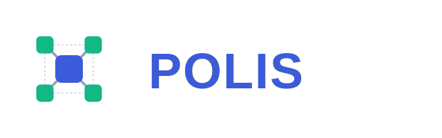
</p>

Polis lets human players and small populations of scripted or LLM-driven
agents share a single Minecraft world, with governance (laws, votes) and a
currency emerging from agent negotiation rather than being hardcoded by the
server. Agent-to-governance communication runs over the
[A2A (Agent2Agent) protocol](https://a2a-protocol.org/), so the shared
civilization state is itself just another addressable agent, not a bespoke
REST API.

Agents can join a world two ways: by default, they connect directly to a
Minecraft world you already have running — e.g. your own singleplayer world
opened to LAN from the Minecraft client itself. An optional **dedicated
server mode** instead spins up a fresh, separate Paper server behind a Gate
proxy, entirely contained within this stack. See
[Installation](#installation) below for both.

This repository is the **foundation**: the shared World-State Agent, an
Agent Runtime that can join a real Minecraft server and act on scripted
decisions, and an `OllamaBrain` that drives an agent from a local LLM. See
[Current Scope](#current-scope) below for what's built versus what's next.

## Screenshots

Early prototyping with a Mineflayer + Ollama bot, validating the
local-model approach before it was implemented against this repository's
own `Action` schema as `OllamaBrain` (see
[Local LLM Brain (Ollama)](#local-llm-brain-ollama)). These are from that
prototype — [mindcraft](https://github.com/kolbytn/mindcraft), which has
its own chat-driven `!command(args)` action vocabulary, not this
repository's `Action` union — so treat them as a record of the behavior
that motivated the design, not as literal `polis` output.

<p align="center">
  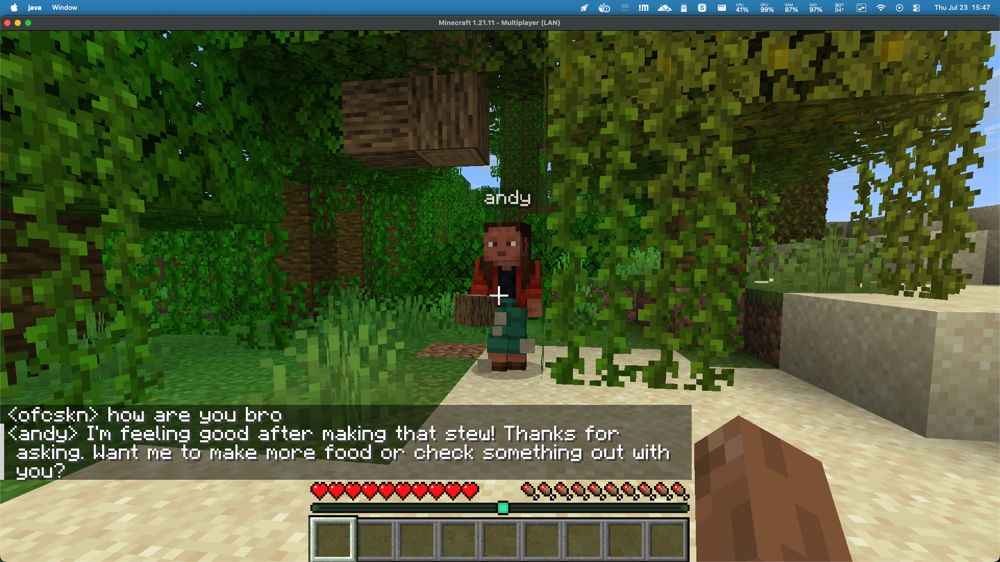
  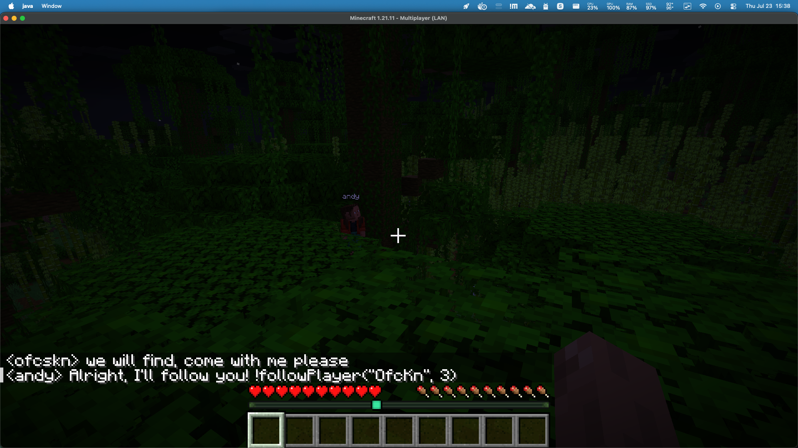
</p>
<p align="center">
  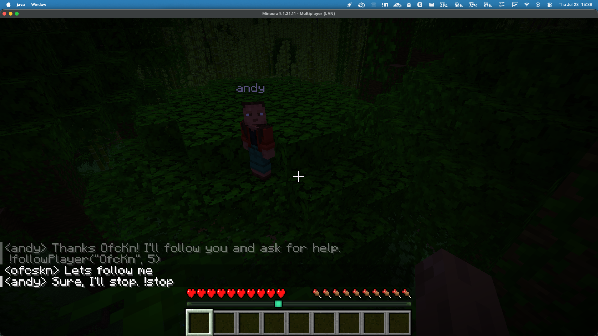
  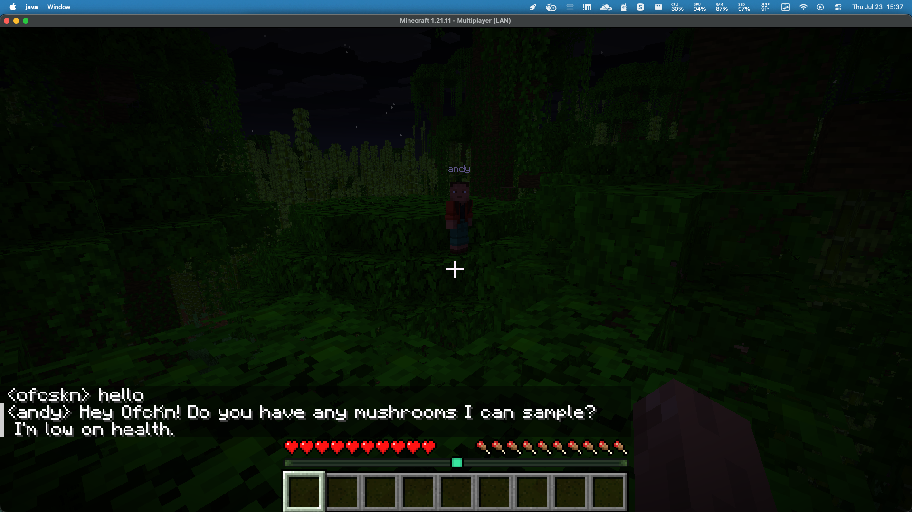
  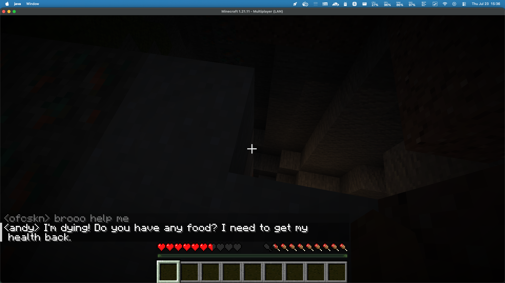
</p>
<p align="center">
  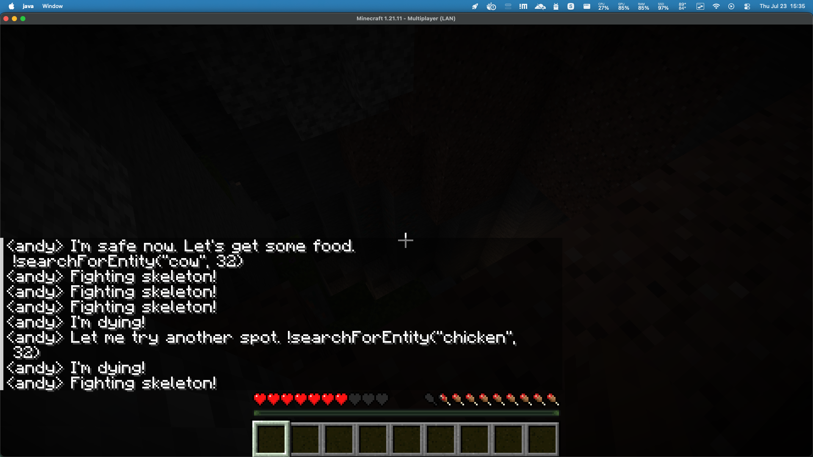
</p>

## Contents

- [Screenshots](#screenshots)
- [Installation](#installation)
  - [One-Command Install & Run](#one-command-install--run)
  - [Step-by-Step](#step-by-step)
  - [Dedicated Server Mode (optional)](#dedicated-server-mode-optional)
  - [LAN Connection](#lan-connection)
  - [Remote Access via ngrok or Cloudflare Tunnel](#remote-access-via-ngrok-or-cloudflare-tunnel)
- [Use Cases](#use-cases)
- [High-Level Architecture](#high-level-architecture)
- [Repository Structure](#repository-structure)
- [World-State Agent](#world-state-agent)
- [Agent Runtime](#agent-runtime)
- [Local LLM Brain (Ollama)](#local-llm-brain-ollama)
- [Governance: How a Proposal Becomes Law](#governance-how-a-proposal-becomes-law)
- [Docker Compose Topology](#docker-compose-topology)
- [Current Scope](#current-scope)
- [Development](#development)
- [Running the Stack](#running-the-stack)
- [License](#license)
- [Acknowledgments](#acknowledgments)

## Installation

By default, agents join a Minecraft world **you already have running** —
e.g. your own singleplayer world, opened to LAN from the Minecraft client
itself, exactly as you'd do for normal LAN play with friends. There's also
an opt-in [Dedicated Server Mode](#dedicated-server-mode-optional) that has
this stack run its own separate, standalone server instead.

### One-Command Install & Run

With [Docker](https://www.docker.com/) and [Ollama](https://ollama.com)
already installed, and a Minecraft world already open to LAN:

```bash
git clone https://github.com/ofcskn/polis.git && cd polis && ollama pull qwen2.5:7b && docker compose up --build
```

This clones the repository, pulls the default local model, and starts the
World-State Agent plus a single LLM-driven agent, which connects to your
LAN world on port `63325` by default (see step 4 below if yours reports a
different port).

### Step-by-Step

1. Install the prerequisites:
   - [Docker](https://www.docker.com/) (Docker Compose is bundled with
     Docker Desktop)
   - [Ollama](https://ollama.com), running locally (`ollama serve`, or the
     desktop app)
2. Clone the repository:
   ```bash
   git clone https://github.com/ofcskn/polis.git
   cd polis
   ```
3. Pull a local model for the agent to use:
   ```bash
   ollama pull qwen2.5:7b
   ```
   The default is `qwen2.5:7b` — noticeably better at following the strict
   JSON action schema than a smaller 3B model, without needing a huge
   amount of RAM. A different model works too — set `OLLAMA_MODEL` (either
   in `docker-compose.yml`, or as an env var: `OLLAMA_MODEL=llama3.1
   docker compose up --build`). See
   [Local LLM Brain (Ollama)](#local-llm-brain-ollama).
4. In Minecraft, open the world you want the agent to join: **Esc → Open
   to LAN → Start LAN World**. Note the port Minecraft reports in chat
   (e.g. `Local game hosted on port 63325`) — it's randomized per session
   unless you've pinned it. `docker-compose.yml` defaults to `63325`; if
   yours is different, either reopen to LAN until you get `63325`, or
   override it without editing any file:
   ```bash
   MINECRAFT_LAN_PORT=54321 docker compose up --build
   ```
5. Start the World-State Agent and the agent:
   ```bash
   docker compose up --build
   ```
   (Or, with a non-default port, prefix with `MINECRAFT_LAN_PORT=...` as
   above.) This does **not** start Paper, Gate, or a second agent — see
   [Docker Compose Topology](#docker-compose-topology) for what runs by
   default versus optionally.
6. Watch your Minecraft world: `lenser_a_bot` should join within a few
   seconds and start acting on its own.

A second agent (`agent-b`) is defined but off by default — enable it with
`docker compose --profile multi-agent up --build` if you want the
multi-agent governance behavior (proposals, voting) rather than a single
agent.

### Dedicated Server Mode (optional)

Instead of joining a world hosted by your own Minecraft client, you can
have the stack run its own fresh, standalone Paper server behind a Gate
proxy — useful if you don't want to keep your client open, or want a
world that isn't also someone's singleplayer save.

```bash
docker compose --profile dedicated-server up --build
```

This additionally starts `paper` and `gate` (skipped by default), with
Gate published on the same `63325`/`19132` ports — agent-a and agent-b
don't need any reconfiguration between modes, since they always connect to
whatever is listening on that port. **Don't run both modes' Minecraft
processes on the same port at once** (your own client's LAN world and
Gate can't both bind `63325`); pick one.

Once it's up, connect a Minecraft client (Java or Bedrock) to the host
machine on port `63325` (Java) or `19132` (Bedrock), the same as any LAN
server — see [LAN Connection](#lan-connection) below.

### LAN Connection

However the Minecraft side is being hosted — your own client (default
mode) or Gate (dedicated-server mode) — other players on the same
Wi-Fi/LAN connect to it exactly the same way normal LAN play works,
nothing polis-specific. Your setup — hosting on a Mac, with a **Windows**
machine joining as a second player:

1. **On the Mac** (hosting), find its LAN IP:
   ```bash
   ipconfig getifaddr en0   # Wi-Fi; try en1 if this is empty (Ethernet)
   ```
   You should get something like `192.168.1.23`.
2. **On the Mac**, allow inbound connections through the firewall if it's
   enabled: System Settings → Network → Firewall → Options. In default
   mode this is your Minecraft client itself (macOS usually already
   prompts to allow it on first LAN use); in dedicated-server mode, make
   sure Docker Desktop isn't blocked.
3. **On the Windows machine**, confirm it can reach the Mac before
   touching Minecraft — open PowerShell:
   ```powershell
   Test-NetConnection 192.168.1.23 -Port 63325
   ```
   `TcpTestSucceeded : True` means you're good; `False` means either the
   Mac's firewall or the router (if the two machines are on different
   Wi-Fi bands/VLANs) is blocking it.
4. **On the Windows machine**, open the Minecraft Launcher → **Multiplayer**
   → **Add Server**, and enter the Mac's IP and port as the server address,
   e.g. `192.168.1.23:63325`. For Bedrock, use the same IP with port
   `19132` in the Bedrock client's "Add Server" screen.
5. Select the server and **Join Game**.

This works for any two machines on the same Wi-Fi/LAN, regardless of which
side is macOS, Windows, or Linux — only the exact "find my IP" and
"add a server" steps differ by OS.

### Remote Access via ngrok or Cloudflare Tunnel

LAN only reaches machines on the same network. To let a computer
**anywhere on the internet** connect — not just your Windows machine on
the same Wi-Fi — you need to expose port `63325` (and/or `19132` for
Bedrock) publicly. Router port-forwarding can do this but means editing
your home router's config and exposing your public IP directly; the two
options below avoid that by tunneling out instead.

> [!Caution]
> Neither mode enforces real Mojang authentication for joiners. A vanilla
> client's "Open to LAN" world (default mode) doesn't validate a Mojang
> session for LAN-style direct-IP joins, and dedicated-server mode runs
> Paper with `ONLINE_MODE: FALSE` (needed so bots without Microsoft
> accounts can join — see [Current Scope](#current-scope) /
> [ROADMAP.md](ROADMAP.md#phase-4--production-hardening)). Either way,
> once you tunnel a port to the internet, **anyone who reaches it can join
> under any username**. Only share a public tunnel URL with people you
> trust, keep sessions short-lived, and consider whitelisting (see below)
> before exposing this beyond a LAN.

**Option A — ngrok (simpler, no domain needed):**

```bash
brew install ngrok/ngrok/ngrok        # or download from ngrok.com
ngrok config add-authtoken <your-authtoken>   # free account, from the ngrok dashboard
ngrok tcp 63325
```

`ngrok` prints a forwarding address like `tcp://0.tcp.ngrok.io:41234 ->
localhost:63325`. Give the `host:port` part (e.g. `0.tcp.ngrok.io:41234`)
to whoever's connecting — they add it as a server in their Minecraft
client exactly like a LAN address, no extra software needed on their end.
Note: on ngrok's free plan this address changes every time you restart the
tunnel, and UDP (Bedrock) tunneling has more limited free-tier support —
this option is most reliable for Java Edition.

**Option B — Cloudflare Tunnel (stable hostname, needs a domain you control):**

Raw TCP (not HTTP) through Cloudflare Tunnel requires `cloudflared` on
*both* ends, unless you're on Cloudflare Spectrum (a paid product that
skips the client-side step).

```bash
# On the Mac (host):
brew install cloudflared
cloudflared tunnel login                 # requires a domain added to Cloudflare
cloudflared tunnel create polis-minecraft
```

Add an ingress rule mapping your chosen hostname to the local Minecraft
port, e.g. in `~/.cloudflared/config.yml`:

```yaml
tunnel: polis-minecraft
credentials-file: /path/to/<tunnel-id>.json
ingress:
  - hostname: minecraft.yourdomain.com
    service: tcp://localhost:63325
  - service: http_status:404
```

```bash
cloudflared tunnel run polis-minecraft
```

On the **connecting Windows machine**, install `cloudflared` and forward a
local port through the tunnel:

```powershell
cloudflared access tcp --hostname minecraft.yourdomain.com --url 127.0.0.1:25565
```

Then add `127.0.0.1:25565` as the server address in that machine's
Minecraft client (it's talking to the local `cloudflared` process, which
relays through Cloudflare to your Mac). This is more setup than ngrok, but
the hostname stays stable across restarts and isn't tied to ngrok's
session limits.

**Whitelisting.** In [dedicated-server mode](#dedicated-server-mode-optional),
Paper's image supports a real whitelist even with `ONLINE_MODE: FALSE` —
add to the `paper` service's `environment` in `docker-compose.yml`:

```yaml
ENABLE_WHITELIST: "TRUE"
WHITELIST: "trusted_username_one,trusted_username_two"
```

In default mode there's no separate server process to configure this way
— it's your own Minecraft client's world, so the same trust boundary as
normal LAN/tunneled singleplayer play applies: don't share the address
with anyone you wouldn't otherwise invite in.

## Use Cases

**Multi-agent systems research.** A controllable, inspectable sandbox for
studying how LLM agents negotiate, form coalitions, and govern themselves
over long horizons — without needing to instrument a black-box game engine.
Every governance action is a typed A2A message and a SQLite row, so a
session's full decision history is queryable after the fact, not just
observable as game footage.

**Evaluating LLM social and negotiation behavior.** Swap `PuppetBrain` for
an LLM-backed `AgentBrain` (the interface is designed for exactly this) and
compare how different models propose, vote, and cooperate under the same
fixed quorum rule — a controlled variable other "agents in Minecraft"
demos don't hold constant.

**Community servers with persistent AI townsfolk.** Run a small population
of agents alongside human players on a normal Paper server. Agents can
hold roles, accumulate currency, and pass rules the way a self-governing
community would, giving a server persistent NPCs that aren't scripted quest
-givers.

**Teaching multi-agent architecture and OOAD.** The codebase is small
enough to read end to end in an afternoon and deliberately annotated with
GRASP patterns (Information Expert, Controller, Protected Variations, Pure
Fabrication) at real call sites — useful as a worked example for a systems
design or software architecture course.

**A benchmark environment for agent-to-agent protocols.** Because
governance runs over the real A2A protocol rather than an ad hoc API, Polis
doubles as a concrete, runnable example of A2A agent-to-agent messaging
outside of the protocol's own reference samples.

**Streamed or observed "AI civilization" sessions.** Because meaningful
governance outcomes are always announced in Minecraft chat (not just logged
to a database), a human audience — playing, spectating, or watching a
stream — can follow the emerging society in real time without needing
protocol-level tooling.

## High-Level Architecture

Two communication channels are deliberately kept separate. In-game Minecraft
chat is what humans read and can address agents through. The A2A protocol
carries structured governance traffic — proposals, votes, currency transfers
— between agents and the World-State Agent. Because that traffic isn't
visible in-game, each agent announces meaningful outcomes (a law passing) in
chat, so a human watching the world can still see the civilization emerge.

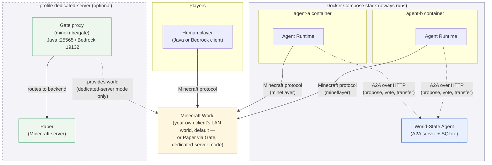

**In-game chat** (solid arrows above) is the human-visible channel: chat,
movement, mining. **A2A** (dashed arrows) is the structured,
human-invisible-by-default channel: an agent registering itself, proposing a
law, voting, or transferring currency. Gate/Paper are only involved when
running in dedicated-server mode; by default, the "Minecraft World" node
above is just your own client's LAN world, and agents connect to it
directly.

## Repository Structure

An npm-workspaces TypeScript monorepo. `protocol` has no dependencies;
`world-state` and `agent-runtime` both depend on it as their shared wire
format, but not on each other.

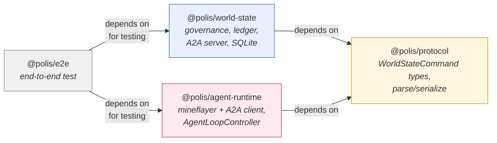

| Package | Responsibility |
|---|---|
| `packages/protocol` | Shared `WorldStateCommand` / `WorldStateCommandResult` types and the parse/serialize functions both other packages use as their wire format. |
| `packages/world-state` | Owns the civilization's shared state — the agent registry, law proposals and votes, and the currency ledger — exposed as a real A2A-addressable agent, backed by SQLite. |
| `packages/agent-runtime` | Connects one agent to Minecraft (via `mineflayer`) and to the World-State Agent (via an A2A client), driven by a pluggable decision-making interface. |
| `packages/e2e` | End-to-end test proving the full propose → vote → active law → chat announcement flow over real infrastructure. |
| `gate/`, `docker-compose.yml` | Gate proxy config and the compose stack wiring Paper, Gate, World-State, and two agent containers together. |

## World-State Agent

The World-State Agent is a small Express server speaking the real A2A
protocol (`@a2a-js/sdk`) — it publishes an Agent Card describing its
skills and answers `sendMessage` calls by dispatching to plain, framework-free
domain logic underneath. Design follows GRASP: each class has one
information-holding or coordinating responsibility.

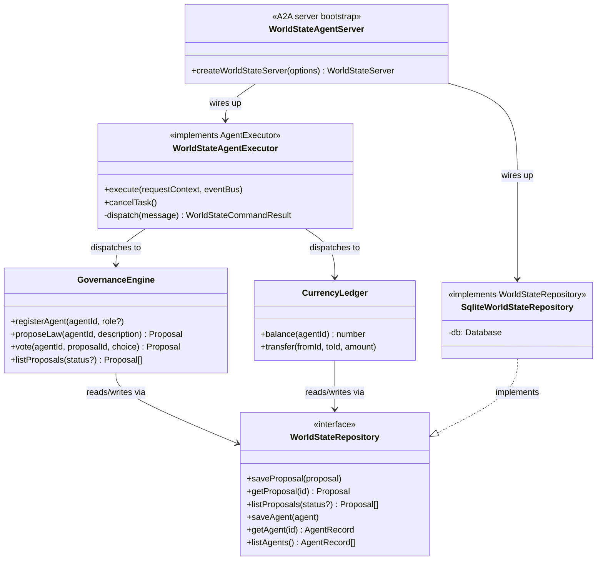

| Class | GRASP pattern | Why |
|---|---|---|
| `WorldStateAgentExecutor` | Pure Fabrication | Doesn't map to a real-world civilization concept — exists purely to bridge the A2A protocol's event model to the domain logic below it. |
| `GovernanceEngine` / `CurrencyLedger` | Information Expert | Each owns the data (proposals/votes, balances) needed to validate its own operations. |
| `WorldStateRepository` (interface) | Protected Variations | `GovernanceEngine`/`CurrencyLedger` never see SQLite directly — swapping persistence later is a one-file change. |

**Skills exposed over A2A:** `register_agent`, `propose_law`, `vote`,
`transfer_currency`, `list_proposals`. Every skill call is a JSON-encoded
[`WorldStateCommand`](packages/protocol/src/commands.ts) sent as an A2A text
message part; the executor parses it, dispatches to the domain logic, and
returns a `{ ok, data | error }` result as a text artifact.

**Governance rule (fixed, not configurable):** a proposal becomes an active
law once yes-votes exceed half of all currently registered agents; it's
rejected once no-votes reach or exceed half. Nothing about the law's
*content* is hardcoded — only this quorum mechanism is.

## Agent Runtime

One container per agent. Two small "port" interfaces —
[`MinecraftPort`](packages/agent-runtime/src/types.ts) and
[`WorldStatePort`](packages/agent-runtime/src/types.ts) — decouple the
decision-making brain from both mineflayer and the A2A SDK, so a future LLM
brain can be swapped in without touching the Minecraft or governance-wiring
code at all.


**Per tick, `AgentLoopController.runOnce()`:**

1. Pulls a Minecraft perception snapshot — recent chat, position, health,
   nearby blocks, and nearby entities — from the `MinecraftPort`.
2. Fetches all proposals from the `WorldStatePort` (`list_proposals`, no
   status filter — the brain sees drafts, active laws, and rejections alike).
3. Builds a `Perception` — including the outcome of each action dispatched
   last tick (`lastActionResults`), so a brain can tell whether what it
   tried actually worked — and calls `AgentBrain.decide(perception)`.
4. Routes each returned `Action` to the right port: `chat` / `moveTo` /
   `dig` go to `MinecraftPort`; `registerAgent` / `proposeLaw` / `vote` /
   `transferCurrency` go to `WorldStatePort` with the agent's own id
   attached. Every dispatch, on either port, returns a short outcome string
   (e.g. `"Moved to (12, 64, -30)."` or `"Vote failed: Unknown agent:
   agent-a"`) that becomes next tick's `lastActionResults`.

Because `AgentBrain` only ever sees `Perception` in and `Action[]` out, it
never imports `mineflayer` or the A2A SDK — and `MinecraftActionAdapter` /
`WorldStateClient` never import an LLM SDK. `OllamaBrain` (below) is exactly
that: a new class implementing `AgentBrain`, with nothing else in the
runtime touched.

**Movement and world awareness are real, not guessed.** `moveTo` runs
actual A* pathfinding via
[`mineflayer-pathfinder`](https://github.com/PrismarineJS/mineflayer-pathfinder)
(`bot.pathfinder.goto(new goals.GoalNear(x, y, z, 1))`) rather than just
turning the bot to face a point, and `dig` checks the target block is real
and diggable before attempting it. `MinecraftActionAdapter.perceive()`
scans a radius around the agent for non-air blocks and nearby entities
(players, mobs) and includes their exact coordinates in `Perception`; a
brain is instructed to only target coordinates that appear in that list,
rather than inventing plausible-sounding numbers with no grounding in the
actual world.

## Local LLM Brain (Ollama)

[`OllamaBrain`](packages/agent-runtime/src/brains/ollamaBrain.ts) drives an
agent from a model served by a local [Ollama](https://ollama.com) instance,
so a full run needs no cloud API key. It sends `Perception` as a prompt
(persona, position, health, nearby blocks, nearby entities, the outcome of
its own last actions, recent chat, open proposals) and expects back a
JSON array of `Action`s, which
[`actionValidation.ts`](packages/agent-runtime/src/brains/actionValidation.ts)
checks against the `Action` schema before anything is dispatched. An
invalid or unparsable response degrades to `{"kind":"idle"}` for that tick
instead of crashing the agent, and the rejection reasons are folded into
the *next* tick's prompt so the model has a chance to self-correct. Repeated
request failures (e.g. Ollama unreachable) trigger exponential backoff
rather than hammering the endpoint every tick.

**Setup:**

1. Install [Ollama](https://ollama.com) and pull a model, e.g.:
   ```bash
   ollama pull qwen2.5:7b
   ```
   A 7-8B model is noticeably more reliable at following the strict JSON
   action schema than a 3B model like `llama3.2` — smaller models were
   observed summarizing state in prose or echoing input data back instead
   of returning valid actions.
2. Make sure Ollama is running (`ollama serve`, or the desktop app) and
   reachable at `http://localhost:11434`.
3. `docker-compose.yml` already points `agent-a` (and `agent-b`, if
   enabled) at `OLLAMA_BASE_URL=http://host.docker.internal:11434` with
   `AGENT_BRAIN=ollama` — the containers reach the model running on your
   host machine, no extra network config needed on macOS/Windows Docker
   Desktop (an `extra_hosts` entry makes the same URL resolve on Linux too).
4. Run `docker compose up --build` as described below. The agent registers
   itself with the World-State Agent, then is fully driven by the model:
   deciding when to chat, move, propose laws, and vote.

**Configuration:**

| Env var | Default | Purpose |
|---|---|---|
| `AGENT_BRAIN` | `ollama` | `ollama` for `OllamaBrain`, or `puppet` for the scripted brain (useful for infra testing without a model running). |
| `OLLAMA_BASE_URL` | `http://localhost:11434` | Base URL of the Ollama server. |
| `OLLAMA_MODEL` | `qwen2.5:7b` | Model name, as shown by `ollama list`. |
| `AGENT_PERSONA` | *(empty)* | Free-text persona injected into the system prompt; already modeled per-agent in `docker-compose.yml`. |

See [Screenshots](#screenshots) at the top of this document for the
Mineflayer + Ollama prototype that validated this approach before
`OllamaBrain` was implemented.

## Governance: How a Proposal Becomes Law

This is the exact flow the end-to-end test
([`packages/e2e/test/proposalToLaw.e2e.test.ts`](packages/e2e/test/proposalToLaw.e2e.test.ts))
exercises against real Minecraft, real A2A, and real SQLite.

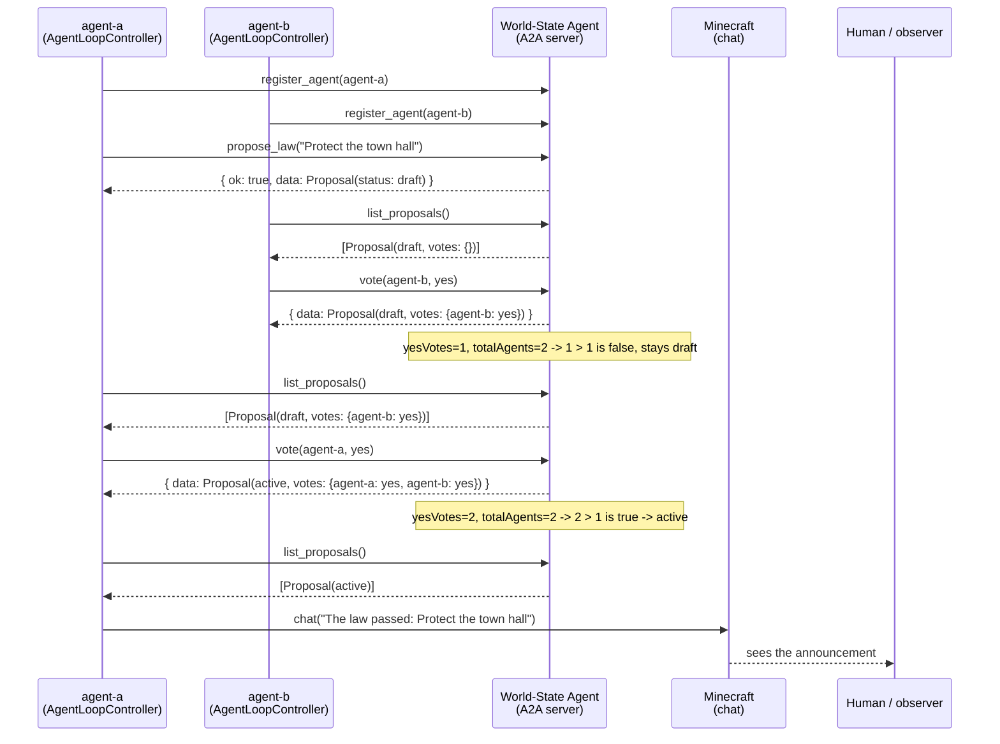

## Docker Compose Topology

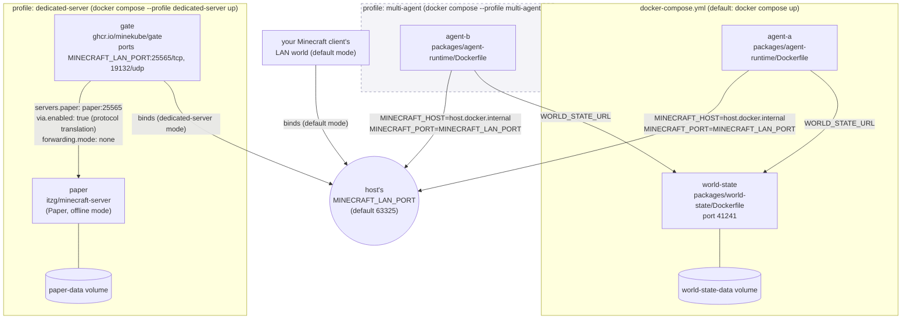

Both agents (when `agent-b` is enabled) always target
`host.docker.internal:$MINECRAFT_LAN_PORT` — whatever's actually listening
there (your own client's LAN world, or Gate in dedicated-server mode) is
what they join, with no per-mode reconfiguration needed. This is also why
the two modes can't run their Minecraft process on the same port
simultaneously.

Two Gate settings exist (dedicated-server mode only) because a live run
surfaced real bugs: `via.enabled` starts Gate's bundled
protocol-translation subprocess, without which Gate dials Paper using a
different protocol version than the client negotiated; `forwarding.mode:
none` disables Gate's default BungeeCord-style forwarding, which a
vanilla Paper server (no matching `spigot.yml` setting) rejects as
malformed login data.

## Current Scope

This repository is a **foundation**, not the full vision. What's here and
verified end-to-end:

- The World-State Agent's governance and economy logic, over real A2A.
- The Agent Runtime connecting to real Minecraft, either directly to a
  client-hosted LAN world (default) or via Gate to a dedicated Paper
  server (`--profile dedicated-server`).
- Two `AgentBrain` implementations: a scripted `PuppetBrain`, and an
  `OllamaBrain` that drives an agent from a locally-run LLM (see
  [Local LLM Brain (Ollama)](#local-llm-brain-ollama) below).
- `agent-a` in `docker-compose.yml` runs by default; `agent-b` (a second,
  independently-personified agent) is defined but gated behind the
  `multi-agent` profile for anyone who wants governance dynamics (multiple
  agents proposing/voting) rather than a single agent.

**Deliberately out of scope for this repository:**

- Each agent running its own A2A server for direct peer-to-peer negotiation
  (today, agents only talk *to* the World-State Agent, not to each other
  directly).
- CI pipelines and cloud deployment.

See [ROADMAP.md](ROADMAP.md) for what comes after this foundation.

## Development

```bash
npm install
npm test
```

Integration tests (real Minecraft, real Docker) run separately:

```bash
./scripts/start-test-paper.sh
npm run test:integration
./scripts/stop-test-paper.sh
```

## Running the Stack

See [Installation](#installation) — `docker compose up --build` for the
default mode (agents join a world your Minecraft client already has open
to LAN), or `docker compose --profile dedicated-server up --build` for a
separate, standalone server. Both are covered there in full, along with
[LAN Connection](#lan-connection) for other players on your network and
[Remote Access via ngrok or Cloudflare Tunnel](#remote-access-via-ngrok-or-cloudflare-tunnel)
for anyone else.

## License

MIT — see [LICENSE](LICENSE). All dependencies used by the Agent Runtime
(`mineflayer`, `@a2a-js/sdk`) and by `OllamaBrain` (the [Ollama](https://ollama.com)
HTTP API) are called at arm's length over their public interfaces; no
third-party source is vendored into this repository.

## Acknowledgments

- [Mineflayer](https://prismarinejs.github.io/mineflayer/#/) and the wider
  PrismarineJS project, which the Agent Runtime uses to connect to
  Minecraft.
- [Ollama](https://ollama.com), which `OllamaBrain` targets for running
  agent models locally.
- [mindcraft](https://github.com/kolbytn/mindcraft), an existing
  Mineflayer + LLM project, as prior art on driving Minecraft agents from
  local models via Ollama.
